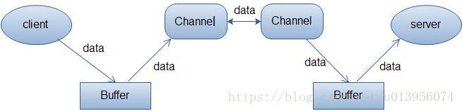

# Netty 搭建 IM

针对掘金课程[《Netty 搭建 IM》](https://juejin.im/book/5b4bc28bf265da0f60130116)的学习笔记。

## 仿微信 IM 系统简介

client 所以请求都转换为 命令

## Netty 是什么？

### 概念
#### 阻塞 / 非阻塞
阻塞和非阻塞针对的是 <b>读</b> 取数据的线程而言的，
+ 阻塞：对于每个输入，一直等着读，来一个读一个，读数据的线程被数据的传输状况阻塞着，所以每个输入，都必须有一个独立的线程进行读取；
+ 非阻塞：对于每个输入，间隔的去查看是否有数据，有数据的话，就进行数据读取，因此可以一线程去轮询全部的输入，然后如果轮询到的输入有数据，那就进行读取；

#### 同步 / 异步
同步和异步针对的是 <b>写</b> 数据的线程而言的，
+ 同步：数据一点一点的交付给读线程，时时刻刻需要通讯；
+ 异步：数据直接写入到对应的位置，数据写完了之后，再通知 读 线程；

#### 分类
|  | 阻塞  | 非阻塞 |
| ---- |---- |---- |
| 同步 | BIO，传统IO | NIO |
| 异步 | 无意义 | AIO |

##### 传统IO (BIO)
每个请求，单独起一个线程进行处理，缺陷：
+ 线程资源有限：服务器上线程资源是有限的，同一个时刻会有大量的请求处于等待状态
+ 线程切换效率低：线程如果增大，那么CPU在大量线程之间频繁的切换，整体服务性能下降
+ 面向字节流，需要自己缓存

##### NIO
一个线程来接受全部的读写请求，然后轮询全部输入请求，进行数据接收。
+ 依旧需要一个线程不断的去轮询

##### AIO
每个请求把数据写完之后，通知对应的处理线程，进行处理；

### 知识点

#### IO
Socket: 一个套接字，用于通讯。
ServerSocket：ServerSocket是等待客户端的请求，一旦获得一个连接请求，就创建一个Socket示例来与客户端进行通信。 

#### NIO
Channel: 通道，数据的输入输出渠道。

Buffer:  缓冲区，实际上是一个容器，一个连续数组。Channel提供从文r、网络读取数据的渠道，但是读写的数据都必须经过Buffer。数据会从Channel进入Buffer，然后又从buffer读取，写入Channel。

[Selector](https://blog.csdn.net/u014634338/article/details/82865622): Selector类是NIO的核心类。Selector能够检测多个注册的通道上是否有事件发送，如果有事件发生，便获取事件然后针对每个事件进行相应的响应处理。这样一来，只是用一个单线程就可以管理多个通道。也就是管理多个连接。这样使得只有在连接真正有读写事件发送时，才会调用函数来进行读写，就大大减少了系统开销，并且不必为每个连接创建一个线程，不用去维护多个线程，并且避免了多线程之间上下文切换导致的开销。

channel的事件：
+ Connect, 连接事件(TCP 连接), 对应于SelectionKey.OP_CONNECT
+ Accept, 确认事件, 对应于SelectionKey.OP_ACCEPT
+ Read, 读事件, 对应于SelectionKey.OP_READ, 表示 buffer 可读.
+ Write, 写事件, 对应于SelectionKey.OP_WRITE, 表示 buffer 可写.

